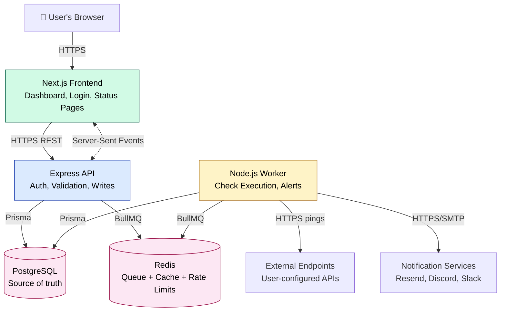
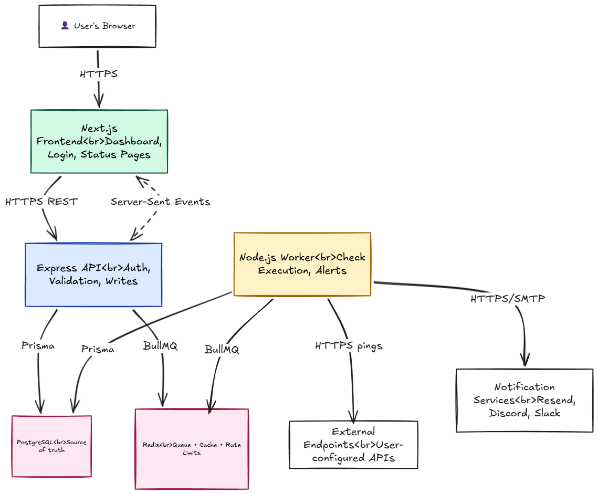

# Pharos — System Architecture

> Status: Living document. Updated as the architecture evolves.
> Last updated: 2026-05-30

## System Overview

Pharos is built as three logical components that share a single database 
and a single Redis instance:

1. A **Next.js web frontend** that serves the dashboard, signup/login 
   flows, and public status pages.
2. An **Express HTTP API** that handles all authenticated read/write 
   operations from the frontend, plus the public REST API consumed by 
   third parties.
3. A **Node.js worker process** that consumes scheduled jobs from a 
   Redis-backed queue, executes HTTP checks against user endpoints, 
   writes results to the database, and triggers alerts on incidents.

The split between API and worker is the most important architectural 
decision in Pharos: the web-facing API never blocks on slow operations 
like HTTP checks or email delivery — those happen asynchronously in 
the worker. This keeps the API responsive under any load and makes 
the system resilient to worker crashes (jobs stay queued until 
processed).

The API and Worker never communicate directly — they share state via 
PostgreSQL and Redis, which keeps each component independently 
scalable and deployable.

PostgreSQL is the source of truth for all persistent data. Redis 
serves three roles: job queue (via BullMQ), cache layer for expensive 
dashboard queries, and rate-limit counter for the public API.

## Components

This section describes each piece of Pharos at a high level. Detailed 
design decisions (which algorithms, exactly which libraries, configuration 
specifics) are made in the phase where each component is built and 
recorded in `DECISIONS.md`.

### Frontend — Next.js + TypeScript + Tailwind + shadcn/ui

What it is: the user-facing website. Dashboard, login, signup, monitor 
management, and public status pages live here.

Why these tools: Next.js is the most widely used React framework today 
and integrates cleanly with TypeScript. Tailwind avoids the time sink 
of naming CSS classes. shadcn/ui gives us professional-looking 
components without locking us into a design system.

How it talks to other components:
- Calls the **API** over HTTPS for all reads and writes.
- Receives live status updates from the **API** over Server-Sent Events.
- Does not talk directly to the database, Redis, or the worker.

### HTTP API — Node.js + Express + TypeScript

What it is: the backend service that the frontend (and external API 
users) call. Handles authentication, authorization, validation, and 
all writes to the database.

Why these tools: Express is the most-taught and most-documented Node.js 
backend framework — perfect for learning. TypeScript catches type 
errors at compile time.

How it talks to other components:
- Receives HTTPS requests from the **Frontend** and external API users.
- Reads and writes to **Postgres** via Prisma.
- Pushes new jobs into **Redis** (via BullMQ) when monitors are 
  created or modified.
- Uses **Redis** as a cache and as a rate-limit counter for the 
  public API.

### Worker — Node.js + BullMQ

What it is: a separate program that does the actual API monitoring 
work. Pulls scheduled "ping this monitor" jobs out of the queue, makes 
the HTTP request, records the result, and triggers alerts when 
incidents happen.

Why a separate process: keeps the API fast and responsive. Slow 
operations like pinging an unreliable endpoint don't block the 
dashboard. See "System Overview" above for the full rationale.

How it talks to other components:
- Pulls jobs from **Redis** via BullMQ.
- Writes check results, incident state, etc. to **Postgres** via Prisma.
- Makes outbound HTTP requests to user-configured **endpoints** (the 
  actual monitoring).
- Sends notifications via **Resend** (email) and **webhooks** (Discord, 
  Slack, user-provided URLs).

### Database — Postgres + Prisma

What it is: a single relational database storing everything that 
needs to persist: users, monitors, checks, incidents, notification 
channels, API keys, status page configs.

Why Postgres: the data is relational (a check belongs to a monitor 
belongs to a user). Postgres handles this naturally with foreign keys 
and transactions.

Why Prisma: provides type-safe database access from TypeScript, with 
a clean migration system. Detailed schema is documented in `SCHEMA.md`.

### Cache + Queue — Redis

What it is: a single Redis instance serving three purposes simultaneously:
- **Job queue:** holds scheduled check jobs (managed by BullMQ).
- **Cache:** stores expensive computed values (like 30-day uptime 
  percentages) for short periods.
- **Rate limit counters:** tracks how many requests each API key has 
  made, for the public API.

Specific algorithms and configurations are decided in the phase where 
each use case is built (Phase 2 for the queue, Phase 3 for the cache, 
Phase 6 for rate limiting).

### Authentication — Better Auth

What it is: a library that handles email/password signup, login, 
password reset, sessions, and API key generation.

Why Better Auth: it's self-hosted, open-source, and exposes the 
session and cookie mechanics clearly so we actually understand how 
auth works — unlike Clerk, which hides these details. Trade-off: 
slightly more configuration upfront in exchange for genuine 
understanding.

### Notifications — Resend (email) + Webhooks

What it is: how Pharos delivers alerts when incidents happen.

- **Resend** for email delivery: modern API, clean SDK, generous free 
  tier.
- **Webhooks** for Discord, Slack, and user-provided URLs: a single 
  code path (send HTTP POST) covers all of them.

### Hosting — Vercel + Railway

- **Vercel** hosts the Next.js frontend. Free, automatic deploys 
  from Git.
- **Railway** hosts the API, Worker, Postgres, and Redis as four 
  services in one project. Generous free tier, simple Dockerfile-based 
  deployment.

We're explicitly avoiding AWS for v1 because the time cost of 
learning IAM, VPCs, and ECS is too high for a project where the 
*application* is what we're trying to demonstrate. A future post-v1 
goal may be migrating to AWS.

## System Diagram

The diagram below shows the components of Pharos and how they 
communicate. Solid arrows are direct calls; the database and Redis 
sit in the middle because both the API and Worker read from and 
write to them, but they never call each other directly.

A higher-fidelity version of the diagram (for slides, presentations, 
and portfolio use):

**Reading the diagram:**

- A **user opens the dashboard.** Their browser loads the Next.js frontend, which calls the Express API over HTTPS for data.
- For **live updates** (a monitor's status changes from up to down), the API pushes events to the frontend over Server-Sent Events.
- The **API** writes to Postgres and Redis, but never calls the worker directly.
- The **Worker** independently pulls jobs from Redis, pings external endpoints, writes results to Postgres, and sends notifications when incidents happen.
- **Postgres** is the source of truth. **Redis** is fast but ephemeral — used for the queue, caching, and rate-limit counters.

## Request Flows

These flows describe what actually happens during Pharos's three most 
important operations. Each flow shows how data and control move through 
the components.

### Flow 1: A user creates a new monitor

This happens when a user fills out the "Add Monitor" form in the 
dashboard.

1. The **Frontend** sends `POST /api/monitors` to the API, with the 
   monitor details (URL, interval, headers, etc.) in the request body 
   and the session cookie for authentication.
2. The **API** middleware validates the session and resolves which 
   user is making the request (authentication).
3. The **API** validates the request body using zod (URL format, 
   interval bounds, etc.). If invalid, it returns 400 with details.
4. The **API** writes a new `Monitor` row to **Postgres** via Prisma. 
   Encrypted credentials (like Authorization headers) are encrypted 
   at rest before being written.
5. The **API** enqueues a recurring "ping this monitor" job into 
   **Redis** via BullMQ, scheduled to run at the configured interval.
6. The **API** returns 201 Created with the new monitor details.
7. The **Frontend** updates the dashboard to show the new monitor.

Total wall-clock time: typically under 200ms. None of this blocks 
on the actual checking; that begins independently in the worker.

### Flow 2: A scheduled check executes

This happens once per interval, per monitor, forever, until the monitor 
is deleted or paused.

1. **BullMQ** in the worker process pulls the next "ping monitor X" 
   job from the **Redis** queue when its scheduled time arrives.
2. The **Worker** loads the monitor's full configuration from 
   **Postgres** (URL, headers, validation rules, etc.), decrypting 
   stored credentials.
3. The **Worker** makes the configured HTTP request to the 
   **external endpoint**, with a timeout (so a hanging endpoint 
   doesn't tie up the worker forever).
4. The **Worker** records the result — status code, response time, 
   response body (if needed for validation), pass/fail — as a new 
   `Check` row in **Postgres**.
5. The **Worker** evaluates incident state: was this check a failure? 
   If yes, was the *previous* check also a failure? After N 
   consecutive failures (the "debouncing threshold"), the monitor 
   is marked as in an incident.
6. If a new incident was opened, the **Worker** enqueues notification 
   jobs (separate from the check job) for each of the user's 
   configured notification channels.
7. BullMQ schedules the next execution of this check job at the 
   configured interval.

The check execution and the notification delivery are intentionally 
separate jobs: if the email service is down, the next check still 
runs on schedule.

### Flow 3: An incident triggers an alert

This happens when the check execution flow above marks a monitor as 
being in an incident.

1. A notification delivery job is in the **Redis** queue (enqueued 
   in step 6 of Flow 2).
2. The **Worker** pulls the job from the queue.
3. The **Worker** loads the user's notification channel configuration 
   (decrypted webhook URLs, email address, etc.) from **Postgres**.
4. The **Worker** makes the appropriate outbound request:
   - For email: calls the **Resend** API.
   - For Discord/Slack: POSTs to the user's webhook URL.
   - For custom webhooks: POSTs to the URL the user provided, with 
     a signed payload (HMAC, so the receiver can verify it really 
     came from Pharos).
5. If the delivery fails (e.g., the user's webhook URL is unreachable), 
   BullMQ retries with exponential backoff. After several failures, 
   the job moves to the dead-letter queue for investigation.
6. The **Worker** also records the notification attempt in **Postgres** 
   for the user's incident history.

Recovery notifications follow the same flow but are triggered when 
consecutive *successful* checks resolve an open incident.

## Anticipated Hard Problems

These are technical challenges identified during architecture design 
that will require careful thought during implementation. Naming them 
upfront isn't the same as solving them — but it's the first step.

### 1. Job execution at scale: when do checks actually run?

With N monitors each scheduled at their own interval, the worker must 
execute checks roughly on time without falling behind. Implications:
- A single slow check (e.g., 30 seconds to time out) shouldn't delay 
  unrelated checks.
- A worker crash mid-check should result in a retry, not a missed check.
- Two workers running simultaneously must never both execute the same 
  scheduled job.

BullMQ's repeated jobs and exclusive-consumption semantics handle 
most of this, but the configuration (concurrency limits per worker, 
retry behavior, timeout values) needs careful tuning. Detailed 
design will happen in Phase 2.

### 2. Idempotency of check execution

If a worker crashes during a check, BullMQ will retry the job. The 
retry must not create duplicate `Check` rows in the database, or 
double-count failures toward the incident debouncing threshold.

Likely approach: use BullMQ's job ID combined with a unique constraint 
on `(monitorId, scheduledFor)` in the database. Detailed design 
in Phase 2.

### 3. Storing high-frequency time-series data

The `Check` table will grow fast. A user with 10 monitors checking 
every minute produces ~14,400 rows per day, ~5.2 million per year. 
At any reasonable user count, naive `SELECT *` queries on this table 
will get slow.

Approaches to consider in Phase 3:
- Aggressive indexing on `(monitorId, createdAt)`.
- Cache aggregated metrics (uptime percentages, response time averages) 
  in Redis with short TTLs.
- Periodic rollup of old data into summary tables, with detailed rows 
  pruned after 90 days.
- TimescaleDB or partitioned tables if scale demands it (probably 
  out of scope for v1).

### 4. Avoiding alert storms

When a monitored endpoint goes down, naive alerting could send the 
user 50 emails per hour. The debouncing logic (N consecutive failures 
to open an incident, M consecutive successes to close it) prevents 
flapping, but the edge cases matter:
- What if the worker restarts mid-incident? The state machine must 
  recover correctly from the database.
- What if the user adds a notification channel during an active 
  incident? Probably no retroactive alerts.
- What if the user marks an incident as "acknowledged"? Suppress 
  further alerts but keep recording check results.

Detailed design in Phase 4.

### 5. Secret management for authenticated checks

Users will store API keys, bearer tokens, and other secrets in 
Pharos so the worker can perform authenticated checks. These must 
be:
- Encrypted at rest in Postgres (likely using libsodium or Node's 
  built-in crypto).
- Encrypted with a key that is *not* in the database (likely a 
  Railway-managed environment variable).
- Never logged, never returned to the API in plaintext (only the 
  worker decrypts them, just before use).
- Rotatable: if the encryption key is rotated, existing secrets 
  must be re-encrypted.

This is some of the most security-sensitive code in Pharos. 
Detailed design in Phase 2 when authenticated checks ship.

---

*This list will grow as implementation reveals new hard problems. 
Each item will eventually be resolved with an entry in `DECISIONS.md`.*